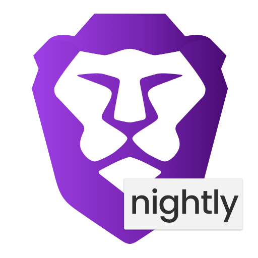

# local-llm-guide
**This is a guide on how to set up LLM's locally for Open WebUI and Brave Browser**

### Why Run a Local LLM Instead of a Non-Local LLM?

Running a local LLM (Language Model) on your own hardware offers several advantages over using cloud-based or remote LLMs:

1. **Privacy and Security:** Your data remains on your local machine, ensuring that sensitive information is not transmitted over the internet or stored on external servers.

2. **Control and Customization:** You have full control over the models you use and can customize them to better suit your specific needs and preferences.

3. **Reduced Latency:** Local LLMs provide faster response times since there is no need to communicate with remote servers, making interactions more efficient and seamless.

4. **Cost Efficiency:** By using your own hardware, you can avoid ongoing subscription fees or usage costs associated with cloud-based LLM services.

5. **Offline Accessibility:** Local LLMs can operate without an internet connection, making them useful in environments with limited or no internet access.

Overall, running a local LLM offers enhanced privacy, control, and efficiency, making it an attractive option for individuals and organizations with specific needs and resource availability.

## Before you continue:
***You should have at least 8 GB of RAM available to run the 7B models, 16 GB to run the 13B models, and 32 GB to run the 33B models.***


## This guide will be in two sections

**first section is for Open WebUI and the second section is for Brave BYOM**

# Table of Contents

- [Setting Up Open WebUI with Ollama](#open-webui)
- [Brave BYOM via Ollama](#brave-byom-via-ollama)
- [Local LLM Setup via LMStudioAI](#brave-byom-via-lmstudio)

# Open WebUI

### Step 1: Install Ollama

Linux command: 
curl -fsSL https://ollama.com/install.sh | sh

as for macOS and Windows go to:

https://ollama.com/download

Check if ollama is running:
http://localhost:11434/


Note: I would also recommend downloading some models before installing Open WebUI 

```
ollama pull llama3-chatqa:8b
```

"A model from NVIDIA based on Llama 3 that excels at conversational question answering (QA) and retrieval-augmented generation (RAG)."

In my experience it's been very good for casual conversations :)

### Step 2: Install Open WebUI via docker - Debian/Ubuntu based distros

Update your package index

```
sudo apt-get update
```

Install packages to allow apt to use a repository over HTTPS
```
sudo apt-get install ca-certificates curl
```

Create a directory for the Docker apt keyring
```
sudo install -m 0755 -d /etc/apt/keyrings
```

Add Docker's official GPG key
```
sudo curl -fsSL https://download.docker.com/linux/ubuntu/gpg -o /etc/apt/keyrings/docker.asc
```

```
sudo chmod a+r /etc/apt/keyrings/docker.asc
```

Add the Docker repository to Apt sources:
```
echo   "deb [arch=$(dpkg --print-architecture) signed-by=/etc/apt/keyrings/docker.asc] https://download.docker.com/linux/ubuntu \
   $(. /etc/os-release && echo "$VERSION_CODENAME") stable" |   sudo tee /etc/apt/sources.list.d/docker.list > /dev/null
```
**Note:** If you are using an Ubuntu derivative distribution, such as Linux Mint, you might need to use `UBUNTU_CODENAME` instead of `VERSION_CODENAME`. However, on Pop!_OS, `VERSION_CODENAME` works correctly.

Update your package index again
```
sudo apt-get update
```

Install Docker Engine, CLI, and containerd
```
sudo apt-get install docker-ce docker-ce-cli containerd.io docker-compose-plugin
```

Use the following command to run a test image
```
sudo docker run hello-world
```
***This command downloads a test image and runs it in a container. If successful, it prints a message confirming that Docker is installed and functioning correctly.***


**Hardware Considerations**


- **AMD Hardware:** You should be good to go.

    **Run Open WebUI without modifications**
    ```
    docker run -d -p 3000:8080 --add-host=host.docker.internal:host-gateway -v open-webui:/app/backend/data --name open-webui --restart always ghcr.io/open-webui/open-webui:main
    ```
    - Runs the container in the background (-d).

    - Maps port 8080 in the container to port 3000 on the host (-p 3000:8080).

    - Enables container-to-host communication (--add-host=host.docker.internal:host-gateway).

    - Creates a persistent volume (-v open-webui:/app/backend/data).

    - Names the container open-webui (--name open-webui).

    - Ensures the container always restarts if it stops or Docker restarts (--restart always).

    - Uses the Open WebUI image from the GitHub Container Registry (ghcr.io/open-webui/open-webui:main).

    ***Run with local host Modifications:***
    ```
    docker run -d --network=host -v open-webui:/app/backend/data -e WEBUI_AUTH=False -e OLLAMA_BASE_URL=http://127.0.0.1:11434 --name open-webui --restart always ghcr.io/open-webui/open-webui:main
    ```
    - Uses the host's network stack to bind directly to 127.0.0.1 (--network=host).
    - Disables authentication (-e WEBUI_AUTH=False).
    - Sets the base URL for Ollama (-e OLLAMA_BASE_URL=http://127.0.0.1:11434).


- **NVIDIA Hardware:** Additional steps are required

    ```
    sudo apt-get update
    ```

    ```
    sudo apt-get install -y nvidia-container-toolkit
    ```

    ```
    sudo systemctl restart docker
    ```

    ***Run Open WebUI - Modififed***
    ```
    sudo docker run -d --network=host -v open-webui:/app/backend/data -e OLLAMA_BASE_URL=http://127.0.0.1:11434 --name open-webui --restart always ghcr.io/open-webui/open-webui:main
    ```
**Notes:**

This setup requires an account. If you prefer not to create one, alternative options are available.

To run the Docker container with your host network, use the following command:

```
sudo docker run -d -p 8080:8080 --name open-webui --network host -e WEBUI_AUTH=False -e OLLAMA_BASE_URL=http://127.0.0.1:11434 ghcr.io/open-webui/open-webui:main
```

This command will make the Docker container use your host network, which can improve performance.
    

How to keep your Docker up-to-date:

```    
docker run --rm --volume /var/run/docker.sock:/var/run/docker.sock containrrr/watchtower --run-once open-webui
```

In case you want to update your local Docker installation to the latest version, you can do it with [Watchtower](https://containrrr.dev/watchtower/).


# Section 2 Brave BYOM:

## Brave BYOM via Ollama

### Step 1: Install Brave Nightly

Download and install Brave Nightly from [https://brave.com/download-nightly/](https://brave.com/download-nightly/).

<p align="center">
  
</p>

### Step 2: Install Ollama

For Linux, use the following command:
```
curl -fsSL https://ollama.com/install.sh | sh
```

Check if ollama is running:
http://localhost:11434/


**Models examle that you can download**
```
ollama pull mathstral
```
```
ollama pull codegeex4
```
```
ollama pull phi3:medium
```

you can find all the models here:
https://ollama.com/library 

### Step 3: 

connect your model to **Brave**.

Label: Can be anything you want.
Model request name: This is important since we are calling that specific model.
Server endpoint: This is **always the same** for ollama
http://localhost:11434/v1/chat/completions


## Brave BYOM via LMStudio

### Step 1: Install Brave Nightly

Download and install Brave Nightly from [https://brave.com/download-nightly/](https://brave.com/download-nightly/).

<p align="center">
  
</p>

### Step 2: Download LMStudio

1. Download LMStudio from [http://lmstudio.ai](http://lmstudio.ai).

   Open it, search for your preferred models in the top bar, and hit Download. Me and Brave recommend Llama3 8B and Mistral 7B since they don't use much memory but are quite capable. If you are feeling fancy, Phi3-medium is good.

   

### Step 3: Start a Local Server

2. Start a local server in the LMStudio app with your chosen model.

   Click on the ↔️ icon in the left sidebar to open the Local Server panel.

   Select a model to load on the dropdown at the top and hit Start Server (in green). Your chosen model is now running on your device!

   

### Step 4: Connect Brave to LMStudio

3. Connect Brave to LMStudio.

   In Brave Nightly, go to Settings > Leo and click Add new model. Enter the model request name as it appears in LMStudio’s Local Server panel.

   Set the Server endpoint to [http://localhost:1234/v1/chat/completions](http://localhost:1234/v1/chat/completions).

   Click "Add model" and you're done!

   

Now you're ready to use your local AI model in Brave Nightly.

Access Leo by pressing Ctrl+B (Cmd+B on macOS).

When you click the gear icon in Leo, the new AI model you added will now be listed as one of your options.

<p align="center">
  
</p>

# Begging sections

If you liked this guide and want to help with my orange juice addiction you can donate here:


***Monero***
<p align="center">
    
</p>

```
47E2j1R4HrCcvV75mNo5DRRmSQcmi9rgKSFkd1o4HbshXx5NCiHu7zsFy7AgiWrEZrZ2o1aLdfNeJPD74y6RNCVC9LvgnnD
```

***Bitcoin***
<p align="center">
    
</p>
    
```
bc1q3zsfj3k0utdkm725rg43vhu3syw0x5va8mzspm
```

***Ethereum***
<p align="center">
    
</p>
    
```
0xc8803D45ADE7c869bC3b15206e81fB47Bb0A44D8
```


***Basic attention token***
<p align="center">
    
</p>
        
```
0xc8803D45ADE7c869bC3b15206e81fB47Bb0A44D8
```